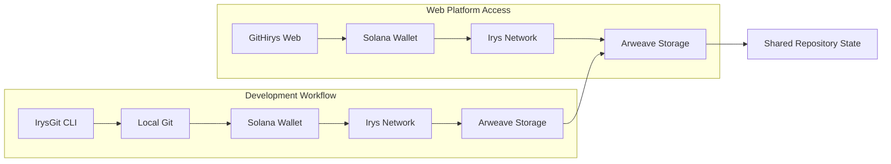
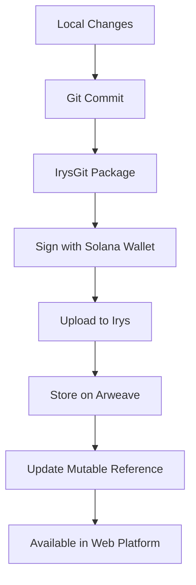
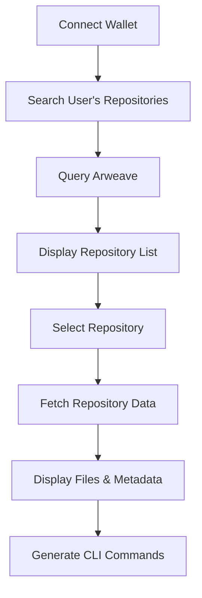
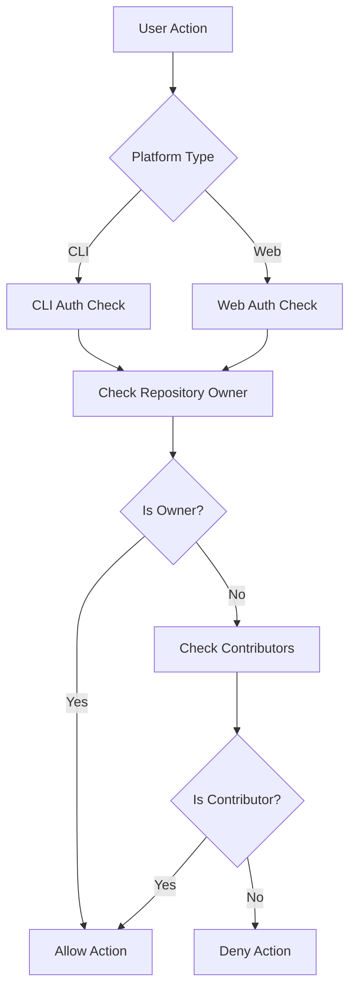

# How the IrysGit Ecosystem Works

This guide explains the technical architecture and concepts behind the IrysGit ecosystem's decentralized version control system, including both the IrysGit CLI and GitHirys web platform.

## Ecosystem Architecture Overview

The IrysGit ecosystem combines two complementary platforms that work together to provide a complete decentralized alternative to Git and GitHub:

```
┌─────────────────────────────────────────────────────────────┐
│                    IrysGit Ecosystem                        │
├─────────────────────────────────────────────────────────────┤
│  IrysGit CLI (Git Alternative)    │  GitHirys Web Platform  │
│  • Command-line interface        │  • Web-based interface  │
│  • Development workflow          │  • Repository management │
│  • Git-compatible commands       │  • Collaboration tools   │
├─────────────────────────────────────────────────────────────┤
│              Shared Authentication Layer                    │
│                (Solana Wallet Integration)                  │
├─────────────────────────────────────────────────────────────┤
│                 Irys Network Layer                          │
├─────────────────────────────────────────────────────────────┤
│                Arweave Blockchain                           │
└─────────────────────────────────────────────────────────────┘
```

## Core Components

### 1. IrysGit CLI - The Git Alternative
The command-line interface that provides familiar Git-like commands:
- **Command Translation**: Translates Git commands to blockchain operations
- **Local Integration**: Works alongside existing Git workflows
- **Batch Operations**: Handles multiple files in single transactions
- **Security**: Manages authentication and permissions locally

### 2. GitHirys Web Platform - The GitHub Alternative
The web-based interface that provides repository management:
- **Repository Exploration**: Visual browsing of repositories and files
- **Collaboration Tools**: Web-based contributor management
- **Real-time Updates**: Live synchronization with blockchain state
- **Modern UI**: Intuitive interface for non-technical users

### 3. Shared Authentication Layer
- **Unified Wallet**: Same Solana wallet works across both platforms
- **Seamless Integration**: No separate account management required
- **Cross-Platform Permissions**: Consistent access control

### 4. Irys Network Layer
- **Data Upload**: Handles upload to Arweave via Irys
- **Cost Optimization**: Mutable uploads reduce costs
- **Reliability**: Ensures data reaches permanent storage

### 5. Arweave Blockchain
- **Permanent Storage**: Immutable data preservation
- **Decentralized Access**: No single point of failure
- **Cryptographic Integrity**: Hash-based verification

## Data Flow Across Platforms

### CLI to Web Platform Integration



### Push Operation (CLI)



### Repository Exploration (Web Platform)



## Platform-Specific Features

### IrysGit CLI Features

#### Local Git Integration
- Uses existing Git for version control
- Maintains compatibility with Git workflows
- Provides staging and commit functionality

#### Command Interface
```bash
# Repository management
igit init MyProject
igit push
igit pull
igit clone

# Branch management
igit branch
igit checkout
igit switch

# Collaboration
igit add-contributor
igit remove-contributor
igit list-contributors
```

#### Security Features
- Encrypted private key storage
- Local authentication only
- Cost limit protection
- Rate limiting

### GitHirys Web Platform Features

#### Repository Management
- Visual repository browsing
- File content viewing
- Branch visualization
- Commit history display

#### Collaboration Tools
- Contributor management UI
- Permission visualization
- Team activity tracking
- Repository sharing

#### Integration Features
- One-click clone command generation
- Wallet-based authentication
- Real-time repository updates
- Cross-platform synchronization

## Storage Model

### Immutable Data Architecture
- **Permanent Commits**: Every push creates immutable Arweave transaction
- **Complete History**: Full version history preserved forever
- **Cryptographic Integrity**: Hash-based verification at every level

### Mutable References System
- **Branch Heads**: Efficient branch updates using mutable uploads
- **Cost Optimization**: Reduces transaction costs for frequent updates
- **Consistency**: Ensures both platforms see same current state

### Data Structure
```json
{
  "repository": {
    "name": "MyProject",
    "owner": "wallet-address",
    "created": "2024-01-15T10:30:22Z",
    "platforms": ["cli", "web"]
  },
  "commit": {
    "hash": "git-commit-hash",
    "author": "wallet-address",
    "timestamp": "2024-01-15T10:30:22Z",
    "message": "Commit message",
    "source": "cli"
  },
  "files": [
    {
      "path": "README.md",
      "hash": "file-hash",
      "size": 1024,
      "viewable": true
    }
  ],
  "metadata": {
    "version": "1.0.0",
    "branch": "main",
    "parent": "parent-transaction-id",
    "web_accessible": true
  }
}
```

## Cross-Platform Permission System

### Unified Permission Model
Both platforms use the same permission system:
- **Repository Owner**: Determined by transaction signer
- **Contributor Lists**: Stored as mutable data on Arweave
- **Cross-Platform Access**: Same permissions apply to both CLI and web

### Permission Verification Flow



## Network Integration

### Multi-Platform Access
- **CLI Access**: Direct command-line interaction
- **Web Access**: Browser-based interface
- **Shared State**: Consistent data across platforms

### Blockchain Integration
- **Solana**: Wallet authentication and transaction signing
- **Irys**: Data upload and optimization
- **Arweave**: Permanent storage and retrieval

## Security Model

### Cross-Platform Security
- **Unified Authentication**: Same Solana wallet for both platforms
- **Consistent Permissions**: Same access control rules
- **Secure Storage**: Private keys never leave client side

### Platform-Specific Security

#### CLI Security
- **Local Encryption**: Private keys encrypted on local machine
- **Secure Communication**: Direct API calls to blockchain
- **Cost Protection**: Built-in upload cost limits

#### Web Platform Security
- **Wallet Integration**: Uses browser wallet extensions
- **Client-Side Auth**: No server-side key storage
- **HTTPS Only**: All communications encrypted

## Synchronization Between Platforms

### Real-Time Updates
- **Immediate Visibility**: CLI pushes appear instantly in web platform
- **Consistent State**: Both platforms query same blockchain data
- **No Sync Delays**: Direct blockchain access eliminates lag

### Conflict Resolution
- **Local Resolution**: Conflicts resolved before pushing
- **Branch-Based**: Use branches for parallel development
- **Manual Integration**: Developers control merge process

## Performance Optimization

### CLI Optimizations
- **Local Caching**: Frequently accessed data cached locally
- **Batch Operations**: Multiple files uploaded in single transaction
- **Smart Compression**: Efficient file packaging

### Web Platform Optimizations
- **Browser Caching**: Repository data cached in browser
- **Lazy Loading**: Files loaded on demand
- **Progressive Enhancement**: Core features work without JavaScript

### Shared Optimizations
- **Deduplication**: Identical files stored once
- **Compression**: Data compressed before upload
- **Efficient Queries**: Optimized blockchain queries

## Platform Comparison

| Feature | IrysGit CLI | GitHirys Web | Traditional Git/GitHub |
|---------|-------------|--------------|------------------------|
| **Interface** | Command-line | Web browser | Both |
| **Storage** | Decentralized | Decentralized | Centralized |
| **Permanence** | Forever | Forever | Server-dependent |
| **Access Control** | Blockchain | Blockchain | Platform-dependent |
| **Offline Work** | Yes | No | Yes |
| **Collaboration** | Basic | Advanced | Advanced |
| **File Viewing** | Local only | Built-in | Built-in |
| **Cost Model** | Upload fees | Free viewing | Platform fees |

## Use Case Scenarios

### Solo Developer
1. **Development**: Use CLI for daily coding
2. **Sharing**: Use web platform to showcase projects
3. **Backup**: Permanent storage ensures code safety

### Team Development
1. **Individual Work**: Each developer uses CLI
2. **Collaboration**: Team uses web platform for coordination
3. **Management**: Project leads use web platform for oversight

### Open Source Projects
1. **Contribution**: Contributors use CLI for development
2. **Discovery**: Community uses web platform for exploration
3. **Maintenance**: Maintainers use both platforms as needed

## Future Enhancements

### Planned CLI Features
- **Smart Contracts**: Automated workflows and governance
- **Multi-Chain Support**: Support for other blockchains
- **Advanced Permissions**: Role-based access control

### Planned Web Platform Features
- **Issue Tracking**: Built-in issue management
- **Pull Requests**: Web-based code review
- **Advanced Collaboration**: Team management tools

### Shared Enhancements
- **Real-time Collaboration**: Live editing capabilities
- **Enhanced Search**: Advanced repository discovery
- **Mobile Apps**: Native mobile applications

## Technical Specifications

### CLI Requirements
- **Node.js**: 16+ for CLI operation
- **Storage**: 100MB disk space
- **Memory**: 512MB RAM
- **Network**: Stable internet connection

### Web Platform Requirements
- **Browser**: Modern web browser (Chrome, Firefox, Safari, Edge)
- **Wallet**: Solana wallet extension
- **JavaScript**: Must be enabled
- **Network**: Stable internet connection

## Troubleshooting

### Common Issues
1. **Cross-Platform Sync**: Repository not appearing in web platform
2. **Authentication**: Wallet connection issues
3. **Permissions**: Access denied errors
4. **Network**: Blockchain connectivity problems

### Debugging Steps
1. **Check Wallet**: Ensure same wallet used on both platforms
2. **Verify Network**: Confirm blockchain connectivity
3. **Clear Cache**: Reset local and browser caches
4. **Transaction Status**: Check Arweave explorer for transaction status

## Developer Resources

### APIs and SDKs
- **CLI API**: Command-line interface for automation
- **Web API**: REST API for web platform integration
- **JavaScript SDK**: For custom applications
- **GraphQL**: For complex queries

### Integration Tools
- **Webhook Support**: Real-time notifications
- **Browser Extensions**: Enhanced web platform integration
- **IDE Plugins**: Editor integration for CLI

## Related Documentation

- [Security Model](./security.md)
- [Permission System](./permissions.md)
- [Network Configuration](./configuration.md)
- [API Documentation](../api/commands.md)
- [Collaboration Guide](../examples/collaboration.md) 